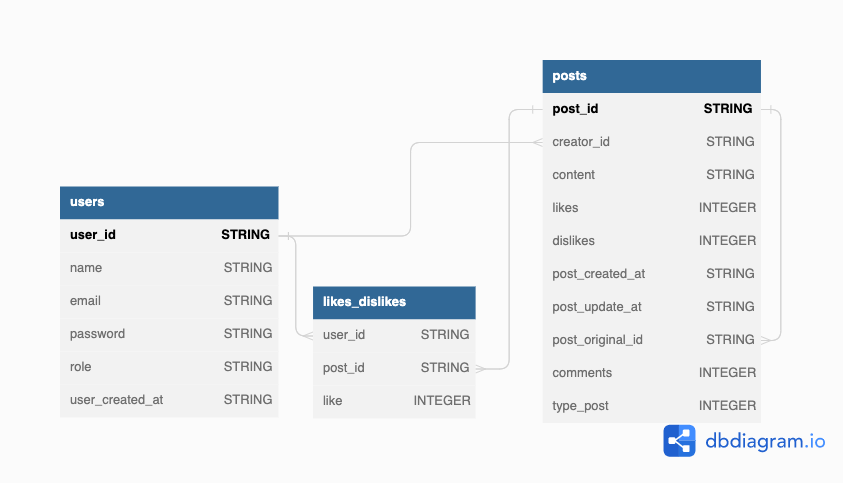

# Labeddit - Backend 
 Inspirado na antiga rede social Reddit. :) 

## Índice
- <a href="#funcionalidades">Funcionalidades </a>
- <a href="#dados">Modelo de Dados </a>
- <a href="#documentacao">Documentação da API</a>
- <a href="#tecnologias"> Técnologias Utilizadas </a>
- <a href="rodar">Como rodar este projeto ? </a>

## Funcionalidades
A API disponibiliza métodos para que o usuário se cadastre e após sua atenticação, é possível criar posts, comentários, dar " likes ou dislikes " em Posts e Comentários publicados.

- [x] getPosts: retorna todos os posts, sem necessidade de autenticação.
- [x] signUp: cria um novo usuário.
- [x] login: autentica um usuário.
- [x] createPost: cria um novo post.
- [x] putLike: faz um like ou dislike no post ou comentário.
- [x] deletePost: exclui um post ou comentário.
- [x] createComment: cria um comentário em um determinado post.
- [x] getPostWithComments: retorna um post com todos os seus comentários e likes ou dislikes.

## Modelo de Dados 


## Documentação da API com deploy na AWS
[Clique aqui!](https://documenter.getpostman.com/view/24461003/2s93XvWQDn)

## Técnologias Utilizadas
- NodeJs 
- TypeScript 
- Express
- Jest 
- Banco de Dados SQLite
- Deploy na AWS


## Como rodar este projeto
```bash
# Clone este diretório 
git clone https://github.com/glauciasonda/projeto-labeddit-backend.git

# Acesse a pasta do projeto no seu terminal 
cd projeto-labeddit-backend

# Instale as dependencias
npm install 

# Execute a aplicação em modo desenvolvimento:
npm run dev 

# A aplicação será iniciada na porta 3003. 

```

